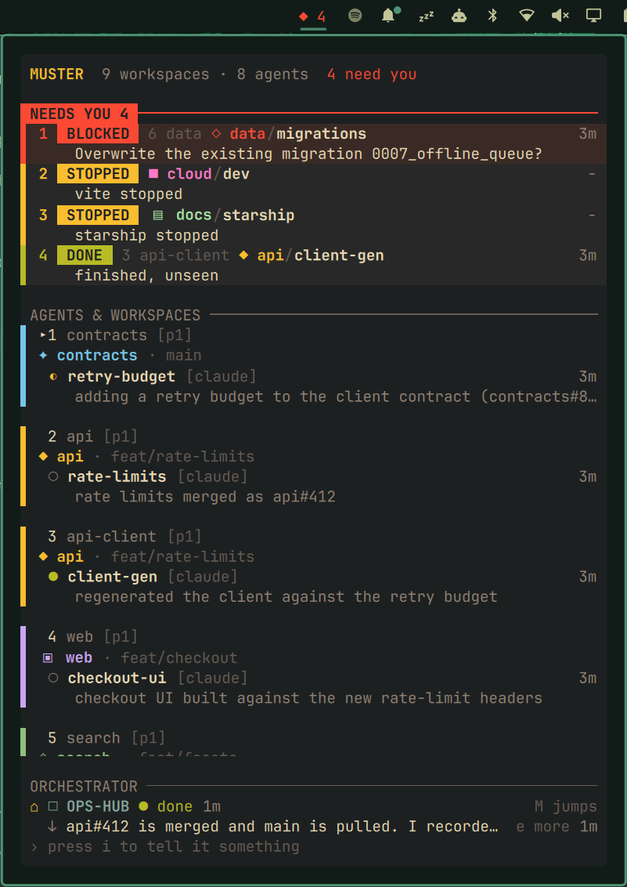

# Muster for Omarchy

[Muster](https://github.com/ofelcan164/muster)'s overlay in the Omarchy bar.

Muster is a herdr plugin: press `prefix+m` in herdr and it shows every agent
across every repo, ranks what needs you, and keeps the orchestrator in view.
That overlay lives inside herdr, so you only see it while you are in your
terminal. This plugin puts the same screen on the desktop. A diamond in the bar
counts what needs you. Click it and the panel shows Muster's overlay, drawn the
same way. Pick an agent and you land on its pane in herdr.



## Requirements

- Omarchy 4
- herdr
- Muster 0.3.0 or newer, installed in herdr. With an older Muster the bar, the
  panel and jumping work, but `i`, `t` and `x` ask you to update it.

## Install

Muster first, in herdr:

```sh
herdr plugin install ofelcan164/muster
```

Then this plugin, in Omarchy:

```sh
omarchy plugin add https://github.com/ofelcan164/muster-omarchy.git --enable
```

The widget joins the right side of the bar. Neither install touches the
other's configuration, and you can remove either one without breaking the
other.

## Usage

### The bar


| Shows | Means |
|---|---|
| `◆ 3`, coloured | Three rows need you. The colour is the most urgent one's: red blocked, orange landed, yellow stopped, green done |
| `◆`, dim | Nothing needs you |
| `◇`, dim | Muster's snapshot is 30 seconds old or more, so `musterd` is not running |
| `◆ !` | The snapshot can't be read, or it comes from a Muster newer than this plugin (update the plugin) |

Hover it for one line per row. The widget stays hidden until Muster has
written its first snapshot.

### The panel

Left-click the diamond. The panel is Muster's overlay in Muster's own colours,
whatever your Omarchy theme:

- **The title line:** workspaces, agents, and how many rows need you.
- **NEEDS YOU:** the ranked rows, less any you have dismissed, each with why it
  is there and what the agent said.
- **Agents & workspaces:** one tile per agent (workspace and pane, repo and
  branch, status, task, what it depends on) and one per workspace with no
  agent. Tiles follow the sort you picked with `s` in the overlay.
- **Orchestrator:** pinned to the bottom. Who is coordinating, their status,
  and their last message.

Click any row, tile or the orchestrator to jump there. herdr's window comes
forward, or opens if you have none, and the panel closes. If herdr is not
running, a jump starts it; jump again once your agents are back.

| Key | Does |
|---|---|
| `j` / `k`, arrows | Move the selection |
| `g` / `G` | First / last |
| `enter` | Jump to the selection |
| `1`–`9` | Jump to that ribbon row |
| `M` | Jump to the orchestrator |
| `i` | Message the orchestrator (`enter` sends, `esc` cancels) |
| `t` | Tell the orchestrator about the selected landed row, or the only one |
| `x` | Dismiss the selected ribbon row until its status changes |
| `e` | Expand or fold the orchestrator's last message |
| `esc` | Fold the message, then close |

`i`, `t` and `x` run the same `muster` commands as the overlay's keys, so both
screens agree: a row dismissed in the panel is gone from the overlay, and the
other way round.

## Configure

Two settings, both usually left alone:

| Setting | Default | What it is |
|---|---|---|
| `stateDir` | empty, meaning `~/.local/state/herdr/plugins/muster` | Where `musterd` writes `snapshot.json` |
| `muster` | `muster` | The `muster` binary. A bare name is looked up on `PATH`, then in the tab bar entry `muster install` wrote to herdr's config |

```sh
omarchy bar set io.github.ofelcan164.muster stateDir ~/some/other/dir
omarchy bar move io.github.ofelcan164.muster --section right
```

Only herdr's default session is shown.

## What it runs

The plugin reads two files Muster writes, `snapshot.json` and `ui.json`, and
keeps no herdr connection of its own. Everything else goes through
`bin/muster-omarchy`, which runs:

- `muster jump`, `tell`, `report` and `dismiss`, for the panel's actions
- `hyprctl`, to find herdr's window and bring it forward after a jump
- `omarchy-launch-terminal-herdr`, when a jump finds herdr not running

It reads herdr's config to find the `muster` binary and never writes it. It
writes nothing of Omarchy's, needs no root, and makes no network requests.

## Remove

```sh
omarchy plugin remove io.github.ofelcan164.muster
```

Muster stays installed in herdr. To remove it too, run `muster uninstall`,
which takes back its keybindings and skill, then remove it from herdr the way
you remove any herdr plugin.

## Development

```sh
node --test tests/*.test.js     # lib/muster.js and bin/muster-omarchy
python3 tests/qml/run.py        # the real QML, headless; needs PySide6
omarchy plugin validate .
qmllint -I "$OMARCHY_PATH/shell" BarWidget.qml Panel.qml
tests/fixtures/regen.sh ~/src/muster   # rebuild the fixture after Muster's model changes
```

`lib/muster.js` is the overlay's drawing rules in plain JavaScript. Each
function names the Go function in Muster it mirrors, and the tests run it
against a snapshot marshalled from Muster's own types. `tests/qml/stubs/`
stands in for Quickshell and Omarchy's `qs.*` modules so the QML can load
without a shell, and the run fails on any QML warning.

## License

MIT. See [LICENSE](LICENSE).
